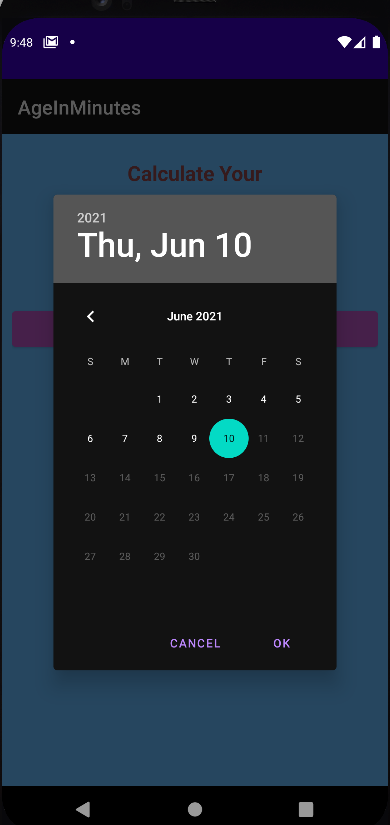
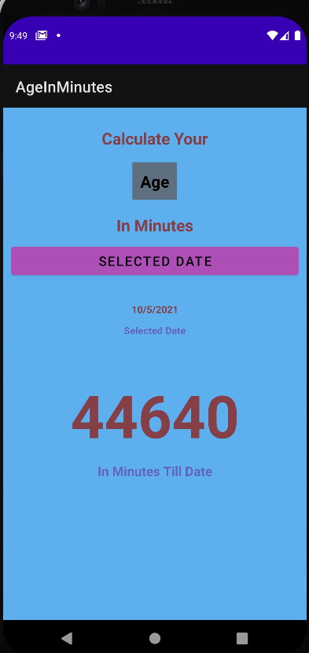

# Age In Minutes App ([Age In Minutes Github](https://github.com/JoeJebitto/Age-In-Minutes-Kotlin-Android))
#
## This App Minutes Made Using

## Output Of the App

### While Openings The App

### While Clicking Selected Date

### After Clicking Ok
   