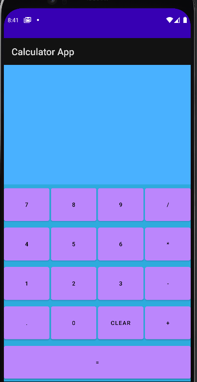
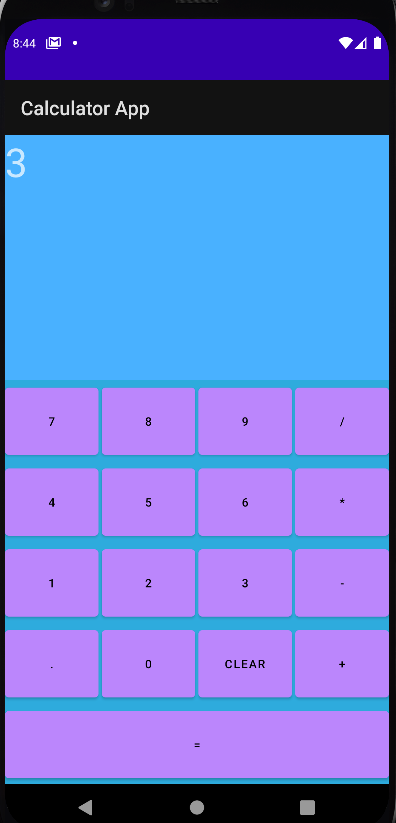
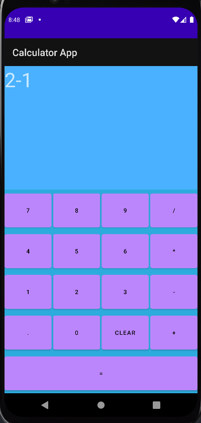
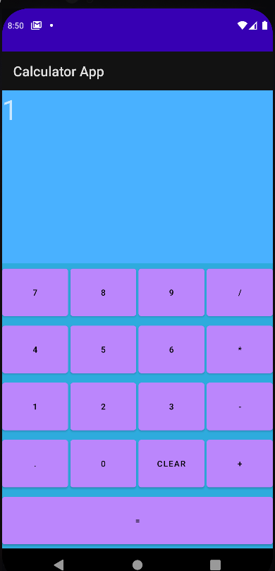
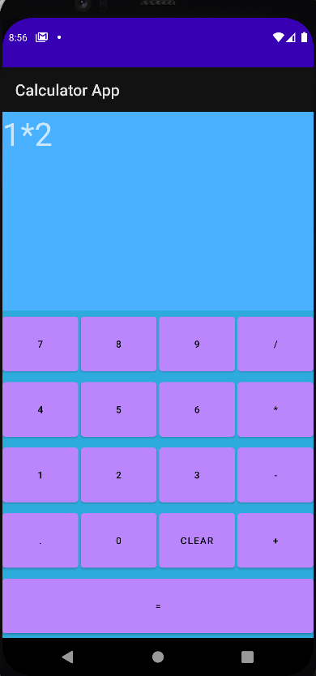
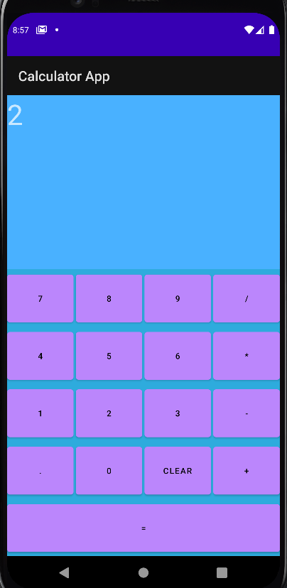
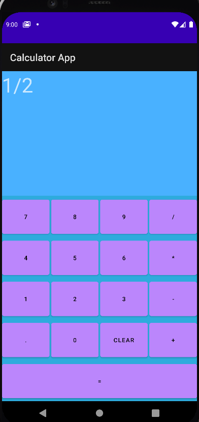
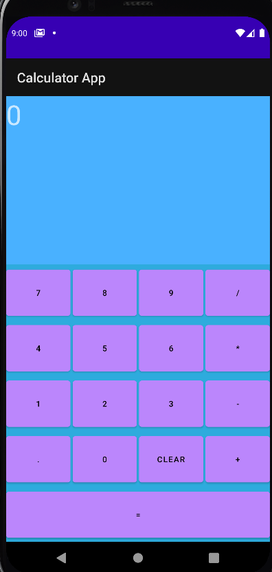

# Age In Minutes App ([Calculator Github](https://github.com/JoeJebitto/Calculator-App-Kotlin-Android))
#
## This App Minutes Made Using


## Output Of The App

### Addition

##
#### Question


##
### Answer


#

### Subtraction

##
#### Question


##
#### Answer


#

### Multiplication
##
#### Question


##
#### Answer


#

### division
##
#### Question


##
#### Answer


# Clone
```shell
    git clone https://github.com/JoeJebitto/Calculator-App-Kotlin-Android
```